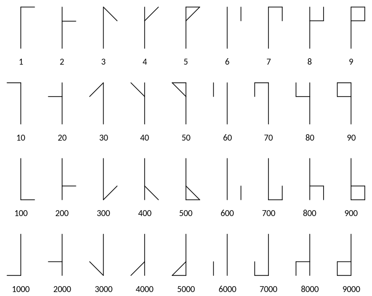

# cistercian-numerals
Small script drawing Cistercian numerals on HTML canvas. Its live here: https://akosnikhazy.github.io/cistercian-numerals/

# About

From Wikipedia:
> The medieval Cistercian numerals, or "ciphers" in nineteenth-century parlance, were developed by the Cistercian monastic order in the early thirteenth century at about the time that Arabic numerals were introduced to northwestern Europe. They are more compact than Arabic or Roman numerals, with a single glyph able to indicate any integer from 1 to 9,999.

I found this a very interesting idea, so I just couldn't help myself and made [this little script](https://github.com/akosnikhazy/cistercian-numerals/blob/main/js/cistercian.js), to draw these numbers onto a canvas. It is with fixed coordinates assuming a 100x100 canvas, feel free to change it. I spent more time making this page than the function itself.

> List of the Cistercian numerals from [Wikipedia](https://en.wikipedia.org/wiki/Cistercian_numerals) image by [Meteoorkip](https://commons.wikimedia.org/wiki/File:Cistercian_digits_(vertical).svg) [CC BY-SA 4.0](https://creativecommons.org/licenses/by-sa/4.0/)

# Zero and negative numbers

While the original system only knew numbers 1-9999, I decided to enhance it and added negative numbers and zero. I found it logical to 0 be just a line and negative numbers to have a horizontal line in the middle. I do not express this at top at the generator because I do not want to give the wrong idea. Yet you can type negative numbers and 0 too. Try it!

Other idea for negatives were mirror the whole thing. It would have been an interesting piece of programming (it could have been solved with the original coordinates). But it would be harder to learn to read the numbers; also there are symmetric numbers like 22 or 9999 itself, where you could not tell if its negative or positive (and this would be the bigger problem with the idea). Marking the negatives with a - in the middle is more straightforward.
